# 工作流程详解：从想法到产品

## 概述

本文档通过流程图和详细说明，展示如何将一个想法转化为可工作的软件产品。我们的工作流程基于渐进式开发、测试驱动和持续验证的原则。

## 完整工作流程图

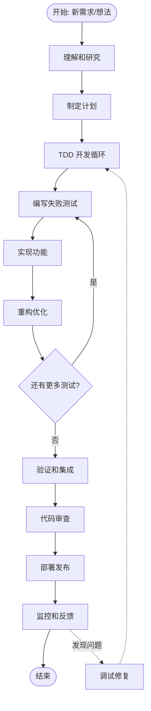

## 阶段详解

### Phase 1: 理解和研究 📚

#### 流程图
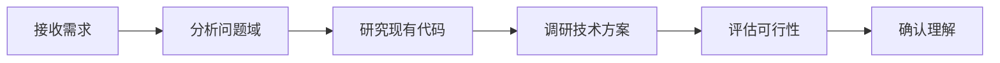

#### 关键活动
| 活动 | 输入 | 输出 | 工具/方法 |
|------|------|------|-----------|
| 需求分析 | 原始需求 | 需求文档 | 用户故事、用例图 |
| 代码研究 | 代码库 | 理解笔记 | 代码阅读、调试 |
| 技术调研 | 技术选项 | 技术评估 | POC、性能测试 |
| 可行性评估 | 所有信息 | 决策建议 | 风险矩阵 |

#### 检查清单
- [ ] 能够用自己的话解释需求
- [ ] 理解相关的业务逻辑
- [ ] 识别了技术约束和限制
- [ ] 评估了不同方案的优劣
- [ ] 与相关方确认了理解

#### 常见陷阱
- ⚠️ 假设理解而不确认
- ⚠️ 忽视非功能需求
- ⚠️ 过早确定技术方案

### Phase 2: 制定计划 📋

#### 流程图
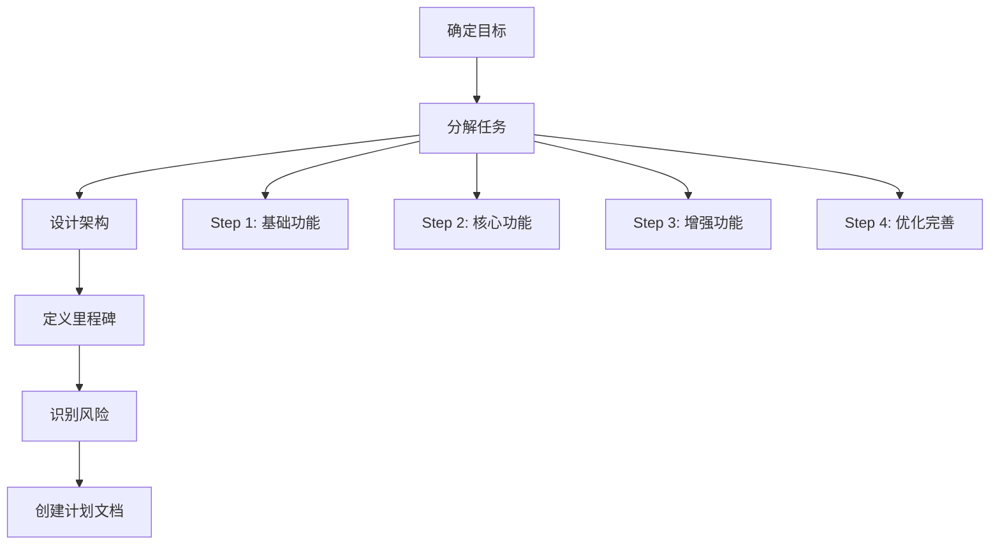

#### 任务分解原则
```
大任务
  ├── 中等任务 (1-2天)
  │   ├── 小任务 (2-4小时)
  │   │   ├── 子任务 (30分钟-1小时)
  │   │   └── 子任务
  │   └── 小任务
  └── 中等任务
```

#### 好的计划特征
1. **可验证**：每步都有明确的完成标准
2. **独立性**：步骤之间耦合度低
3. **渐进式**：每步都产生价值
4. **灵活性**：可以根据反馈调整

#### 计划模板
```markdown
## Step X: [名称]
**目标**: 一句话说明要实现什么
**时间**: 预计X小时
**前置条件**: 
  - 条件1
  - 条件2
**任务列表**:
  - [ ] 具体任务1
  - [ ] 具体任务2
**验证标准**:
  - [ ] 测试通过
  - [ ] 功能可演示
**风险**: 
  - 风险1 → 缓解措施
```

### Phase 3: TDD 开发循环 🔄

#### 详细流程图
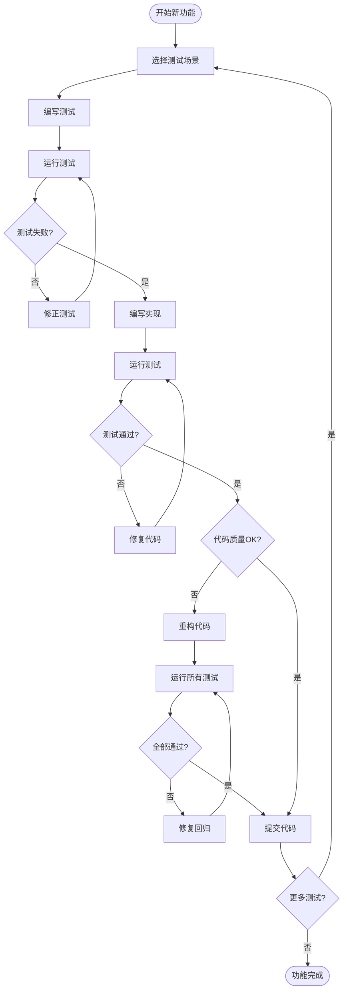

#### TDD 节奏
```
时间分配建议：
🔴 RED (10分钟)
  └─> 思考测试场景 (3分钟)
  └─> 编写测试代码 (5分钟)
  └─> 运行确认失败 (2分钟)

🟢 GREEN (15分钟)
  └─> 实现功能代码 (10分钟)
  └─> 调试到通过 (5分钟)

🔵 REFACTOR (10分钟)
  └─> 识别改进点 (2分钟)
  └─> 重构代码 (6分钟)
  └─> 验证测试 (2分钟)

总计：~35分钟一个循环
```

#### 测试策略
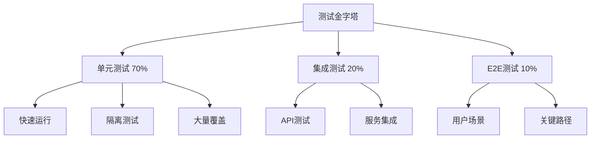

### Phase 4: 验证和集成 ✅

#### 验证流程
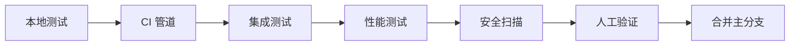

#### CI/CD 管道
```yaml
pipeline:
  stages:
    - build:
        - 编译代码
        - 生成构建产物
    
    - test:
        - 单元测试
        - 代码覆盖率
        - 代码质量检查
    
    - integration:
        - 集成测试
        - API 测试
        - 数据库迁移测试
    
    - security:
        - 依赖漏洞扫描
        - 代码安全扫描
        - 密钥泄露检查
    
    - deploy:
        - 部署到测试环境
        - 烟雾测试
        - 性能测试
```

### Phase 5: 代码审查 👀

#### 审查流程
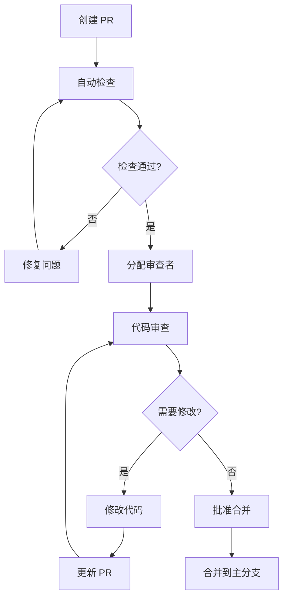

#### 审查重点
| 层面 | 关注点 | 重要性 |
|------|--------|--------|
| 正确性 | 功能是否正确实现 | 🔴 关键 |
| 安全性 | 是否有安全漏洞 | 🔴 关键 |
| 性能 | 是否有性能问题 | 🟡 重要 |
| 可读性 | 代码是否易懂 | 🟡 重要 |
| 测试 | 测试是否充分 | 🟡 重要 |
| 风格 | 是否符合规范 | 🔵 一般 |

#### 审查沟通模板
```markdown
## 严重问题 🔴
**位置**: `file.js:42`
**问题**: SQL 注入风险
**建议**: 使用参数化查询
​```javascript
// 建议的代码
​```

## 改进建议 🟡
**位置**: `file.js:100`
**建议**: 可以提取为独立函数提高复用性

## 优秀实践 🟢
**位置**: `file.js:200`
很好的错误处理实现，值得在其他地方推广！
```

### Phase 6: 部署发布 🚀

#### 部署策略
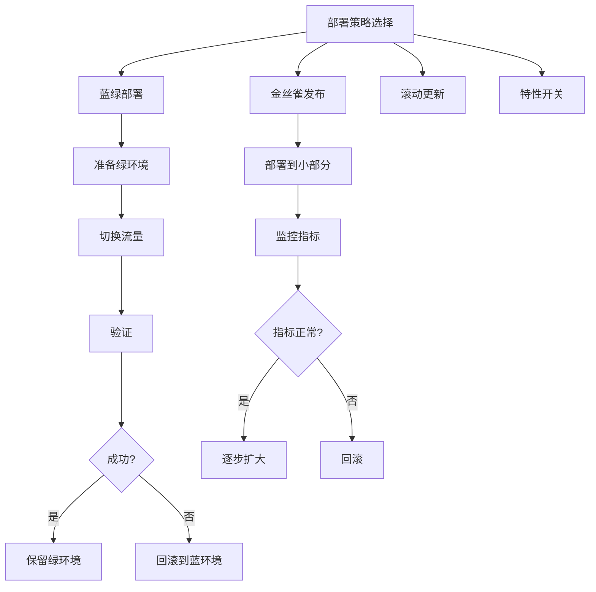

#### 部署检查清单
```yaml
部署前:
  - [ ] 所有测试通过
  - [ ] 代码已审查合并
  - [ ] 数据库迁移准备
  - [ ] 配置更新完成
  - [ ] 回滚方案准备
  - [ ] 相关方已通知

部署中:
  - [ ] 监控仪表板打开
  - [ ] 日志实时查看
  - [ ] 错误率监控
  - [ ] 性能指标监控
  - [ ] 用户反馈通道

部署后:
  - [ ] 烟雾测试通过
  - [ ] 关键功能验证
  - [ ] 性能基线对比
  - [ ] 错误日志检查
  - [ ] 用户反馈收集
```

### Phase 7: 监控和反馈 📊

#### 监控体系
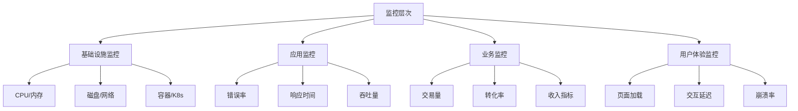

#### 反馈循环
```
用户反馈 ─┐
         ├─> 收集 ─> 分析 ─> 优先级 ─> 行动
监控告警 ─┤                              │
         └─────────────────────────────┘
```

## 问题处理流程

### 调试工作流
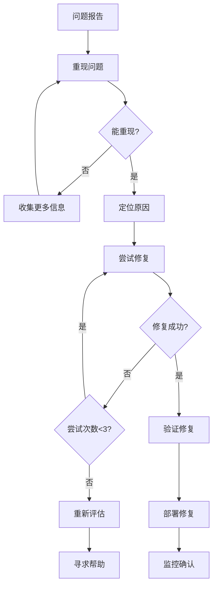

### 三次尝试规则应用
```
尝试 1 (15分钟)
  ├── 最明显的解决方案
  ├── 快速验证
  └── 记录结果

尝试 2 (30分钟)
  ├── 调整方法
  ├── 更深入的调试
  ├── 查阅文档
  └── 记录发现

尝试 3 (45分钟)
  ├── 完全不同的思路
  ├── 重新审视假设
  ├── 搜索类似问题
  └── 准备升级材料

停止并重新评估
  ├── 总结已知信息
  ├── 列出所有假设
  ├── 识别知识盲区
  └── 决定下一步行动
```

## 工具和自动化

### 自动化工具链
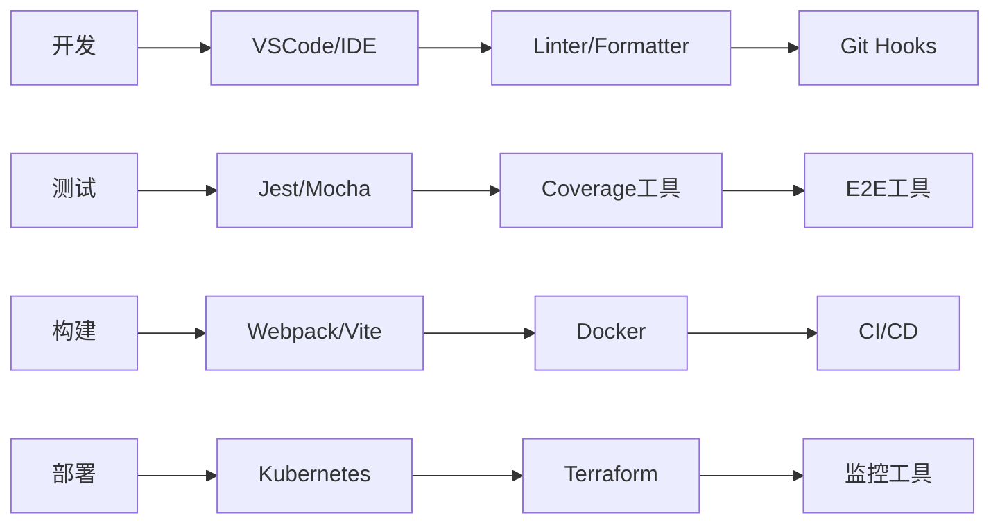

### 常用命令和脚本
```bash
# 开发工作流
npm run dev          # 启动开发服务器
npm run test:watch   # 监听模式运行测试
npm run lint:fix     # 自动修复代码风格

# 质量检查
npm run test:coverage  # 运行测试并生成覆盖率
npm run audit         # 安全漏洞扫描
npm run build         # 构建生产版本

# Git 工作流
git flow feature start <name>  # 开始新功能
git commit -m "type: message"  # 规范化提交
git flow feature finish <name> # 完成功能

# 部署相关
./scripts/deploy.sh staging    # 部署到预发布
./scripts/rollback.sh          # 回滚到上一版本
./scripts/health-check.sh      # 健康检查
```

## 团队协作流程

### 每日站会
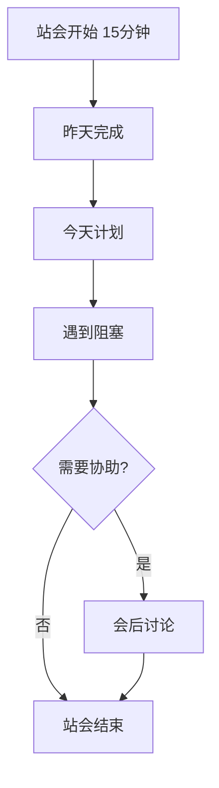

### 迭代流程
```
Sprint (2周)
├── Day 1: 计划会议
│   ├── 评审待办事项
│   ├── 估算工作量
│   └── 承诺交付内容
├── Day 2-9: 开发
│   ├── 每日站会
│   ├── 开发和测试
│   └── 持续集成
├── Day 10: 准备演示
└── Day 11: 
    ├── Sprint 评审
    └── 回顾会议
```

## 最佳实践总结

### Do's ✅
1. **小步提交**：每个提交都应该是完整的、可工作的
2. **持续集成**：频繁合并，减少冲突
3. **及时重构**：看到问题立即改进
4. **充分测试**：测试是信心的来源
5. **文档同步**：代码和文档一起更新

### Don'ts ❌
1. **大爆炸集成**：避免长时间不合并
2. **忽视警告**：Linter 警告要及时处理
3. **跳过测试**：不要为了快而跳过测试
4. **过度设计**：不要为不存在的需求设计
5. **单独工作**：遇到问题要及时沟通

## 工作流优化建议

### 识别瓶颈
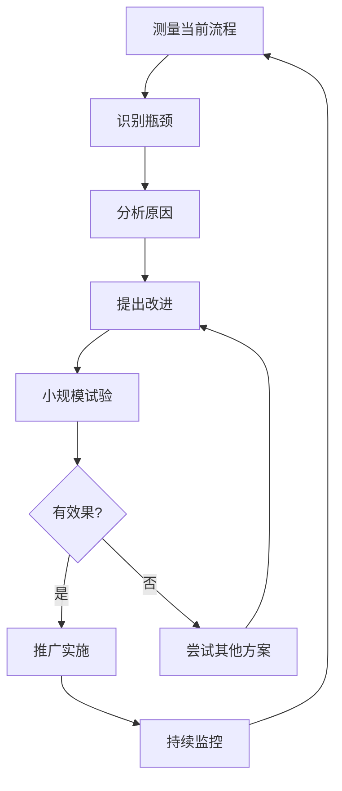

### 持续改进
- **每周回顾**：团队分享本周学到的东西
- **月度优化**：选择一个流程进行优化
- **季度评估**：评估工具和流程的效果
- **年度规划**：制定技术债务偿还计划

## 总结

好的工作流程不是一成不变的，而是随着团队和项目的成长不断演进的。关键是：
1. 保持流程简单明了
2. 自动化重复性工作
3. 持续收集反馈
4. 勇于尝试新方法
5. 记录和分享经验

记住：流程是为了帮助我们更好地工作，而不是限制我们。当流程成为障碍时，就是改进它的时候了。