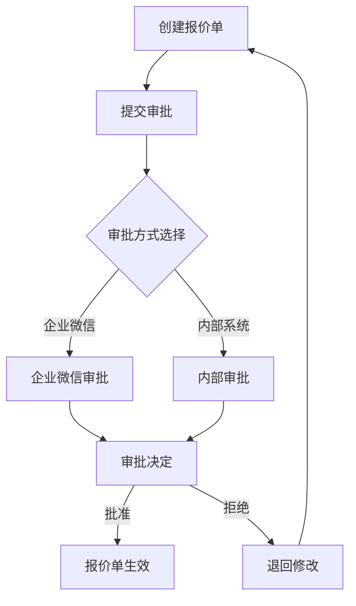

# 统一审批系统用户指南

**版本**: 1.0
**日期**: 2025-09-16
**适用系统**: 芯片报价系统 v1.0+

## 📋 目录

1. [系统概述](#系统概述)
2. [用户角色说明](#用户角色说明)
3. [审批流程](#审批流程)
4. [前端操作指南](#前端操作指南)
5. [API使用指南](#api使用指南)
6. [审批方式说明](#审批方式说明)
7. [故障排除](#故障排除)
8. [常见问题FAQ](#常见问题faq)

---

## 🎯 系统概述

统一审批系统是芯片报价系统的核心审批模块，支持两种审批方式的统一管理：

- **企业微信审批**：通过企业微信工作流进行审批（推荐）
- **内部审批**：系统内部审批流程（备选方案）

### 核心特性

✅ **智能审批方式选择**：系统自动选择最佳审批方式
✅ **统一用户界面**：一套界面管理所有审批
✅ **实时状态同步**：审批状态实时更新
✅ **完整审批历史**：支持审批轨迹追溯
✅ **跨平台兼容**：支持桌面端和移动端访问

---

## 👥 用户角色说明

### 1. 报价申请人 (Quote Creator)
- **权限**：创建报价单、提交审批申请、查看审批状态
- **操作范围**：自己创建的报价单

### 2. 审批人 (Approver)
- **权限**：审批报价单、添加审批意见、查看审批历史
- **操作范围**：被分配的待审批报价单

### 3. 管理员 (Admin)
- **权限**：管理所有报价单、配置审批流程、查看系统统计
- **操作范围**：所有报价单和系统设置

### 4. 超级管理员 (Super Admin)
- **权限**：完整系统管理权限、用户权限管理
- **操作范围**：整个系统

---

## 🔄 审批流程

### 标准审批流程



### 审批状态说明

| 状态 | 说明 | 可操作 |
|------|------|---------|
| `draft` | 草稿状态 | 编辑、提交 |
| `pending` | 待审批 | 查看状态 |
| `approved` | 已批准 | 查看、导出 |
| `rejected` | 已拒绝 | 查看原因、重新编辑 |
| `cancelled` | 已取消 | 查看 |

---

## 💻 前端操作指南

### 1. 访问统一审批界面

#### 桌面端访问
1. 登录芯片报价系统
2. 进入"报价管理"页面
3. 点击任意报价单进入详情页
4. 在页面右侧找到"统一审批面板"

#### 移动端访问
1. 通过企业微信工作台访问
2. 点击"芯片报价系统"应用
3. 进入报价单详情页面
4. 审批面板自动适配移动端显示

### 2. 提交审批申请

#### 步骤说明
1. **准备报价单**：确保报价单信息完整准确
2. **检查审批条件**：确认报价金额、设备选择等符合审批要求
3. **提交审批**：
   ```
   点击"提交审批"按钮 →
   确认审批信息 →
   系统自动选择审批方式 →
   审批流程启动
   ```

#### 界面操作
- **统一审批开关**：页面顶部切换开关，默认开启
- **提交按钮**：绿色"提交审批"按钮
- **状态显示**：实时显示当前审批状态

### 3. 审批操作

#### 审批人操作步骤
1. **接收审批通知**：
   - 企业微信：通过企业微信消息接收通知
   - 内部系统：通过系统内消息接收通知

2. **查看报价详情**：
   - 点击审批通知进入报价详情页
   - 仔细检查报价内容和计算结果

3. **执行审批决定**：
   ```
   批准：点击"批准"按钮 → 填写审批意见（可选）→ 确认
   拒绝：点击"拒绝"按钮 → 填写拒绝原因（必填）→ 确认
   ```

### 4. 查看审批状态和历史

#### 状态查看
- **实时状态**：报价单详情页顶部显示当前状态
- **状态变化**：系统自动刷新，显示最新状态
- **审批进度**：显示审批流程进度条

#### 历史记录
- **审批历史**：点击"查看历史"查看完整审批轨迹
- **操作记录**：显示每次操作的时间、操作人、操作内容
- **状态变更**：记录所有状态变更的详细信息

---

## 🔌 API使用指南

### 基础信息
- **基础URL**：`http://your-domain.com/api/v1/approval`
- **认证方式**：Bearer Token（通过登录获得）
- **数据格式**：JSON

### 1. 查询审批状态

```http
GET /api/v1/approval/status/{quote_id}
Authorization: Bearer <your_token>
```

**响应示例**：
```json
{
  "quote_id": "da496add-fe64-4c34-a836-e2fffc8ea010",
  "quote_number": "Q20250916001",
  "status": "pending",
  "approval_status": "pending",
  "submitted_at": "2025-09-16T10:30:00Z",
  "approved_at": null,
  "approved_by": null,
  "rejection_reason": null,
  "wecom_approval_id": "202509160001",
  "has_wecom_approval": true
}
```

### 2. 查询审批历史

```http
GET /api/v1/approval/history/{quote_id}
Authorization: Bearer <your_token>
```

**响应示例**：
```json
{
  "quote_id": "da496add-fe64-4c34-a836-e2fffc8ea010",
  "history": [
    {
      "id": 1,
      "action": "submit",
      "status": "pending",
      "approver_id": "user123",
      "comments": "提交审批",
      "processed_at": "2025-09-16T10:30:00Z",
      "created_at": "2025-09-16T10:30:00Z"
    }
  ],
  "total": 1
}
```

### 3. 提交审批申请

```http
POST /api/v1/approval/submit/{quote_id}
Authorization: Bearer <your_token>
Content-Type: application/json

{
  "comments": "请审批这个报价单",
  "method": null
}
```

**响应示例**：
```json
{
  "message": "审批已提交",
  "approval_method": "wecom",
  "new_status": "pending",
  "approval_id": "202509160001",
  "success": true
}
```

### 4. 批准报价单

```http
POST /api/v1/approval/approve/{quote_id}
Authorization: Bearer <your_token>
Content-Type: application/json

{
  "comments": "报价合理，批准"
}
```

### 5. 拒绝报价单

```http
POST /api/v1/approval/reject/{quote_id}
Authorization: Bearer <your_token>
Content-Type: application/json

{
  "reason": "价格过高，需要重新核算",
  "comments": "请重新计算设备成本"
}
```

---

## ⚙️ 审批方式说明

### 企业微信审批（推荐）

#### 优势
✅ **移动优先**：支持手机随时随地审批
✅ **消息通知**：即时消息推送，不错过任何审批
✅ **身份验证**：企业微信身份验证，安全可靠
✅ **审批历史**：企业微信中保留完整审批记录

#### 使用条件
- 用户已绑定企业微信账号
- 系统已配置企业微信审批模板
- 网络环境支持访问企业微信API

#### 审批流程
1. 系统自动在企业微信中创建审批流程
2. 审批人通过企业微信接收审批通知
3. 在企业微信中直接进行审批操作
4. 审批结果自动同步回系统

### 内部系统审批（备选）

#### 优势
✅ **完全自主**：不依赖外部系统
✅ **定制化强**：可根据需求灵活定制
✅ **网络独立**：支持内网环境使用
✅ **数据安全**：所有数据保存在内部系统

#### 使用场景
- 企业微信不可用时的备选方案
- 对数据安全有特殊要求的场景
- 需要高度定制化审批流程的场景

#### 审批流程
1. 系统内部创建审批任务
2. 通过系统内消息通知审批人
3. 审批人登录系统进行审批
4. 审批结果立即生效

### 自动选择逻辑

系统会根据以下优先级自动选择审批方式：

1. **优先选择企业微信审批**：
   - 用户已绑定企业微信
   - 企业微信服务正常
   - 网络连接正常

2. **备选内部系统审批**：
   - 企业微信不可用
   - 用户未绑定企业微信
   - 明确指定使用内部审批

---

## 🔧 故障排除

### 常见问题及解决方案

#### 1. 审批提交失败

**问题现象**：点击"提交审批"后出现错误
**可能原因**：
- 报价单状态不正确
- 用户权限不足
- 网络连接问题

**解决步骤**：
1. 检查报价单是否为草稿状态
2. 确认当前用户是报价单创建者
3. 检查网络连接
4. 刷新页面重试

#### 2. 企业微信审批不可用

**问题现象**：系统提示"企业微信审批服务不可用"
**解决步骤**：
1. 检查企业微信绑定状态
2. 确认企业微信网络连接
3. 联系管理员检查企业微信配置
4. 使用内部审批作为临时方案

#### 3. 审批状态不更新

**问题现象**：审批后状态没有及时更新
**解决步骤**：
1. 手动刷新页面
2. 检查网络连接
3. 等待2-3分钟后再次查看
4. 如持续不更新，联系技术支持

#### 4. 权限不足错误

**问题现象**：提示"权限不足"或"访问被拒绝"
**解决步骤**：
1. 确认用户角色和权限
2. 检查是否有权限操作该报价单
3. 联系管理员分配相应权限
4. 重新登录系统

---

## ❓ 常见问题FAQ

### Q1: 如何切换审批方式？
**A**: 系统会自动选择最佳审批方式。如需手动指定，可在提交审批时通过API指定`method`参数（`wecom`或`internal`）。

### Q2: 审批通知延迟怎么办？
**A**: 企业微信审批通知通常在30秒内送达。如延迟，请检查企业微信设置或使用系统内消息查看。

### Q3: 可以撤回已提交的审批吗？
**A**: 目前系统不支持撤回功能。如需修改，请联系审批人拒绝当前申请，然后重新提交。

### Q4: 审批历史会保存多久？
**A**: 审批历史永久保存，可随时查看完整的审批轨迹。

### Q5: 支持批量审批吗？
**A**: 当前版本暂不支持批量审批，每个报价单需要单独审批。

### Q6: 如何设置审批人？
**A**: 审批人由系统管理员在后台配置，或根据组织架构自动分配。

### Q7: 移动端和桌面端功能有差异吗？
**A**: 核心审批功能完全一致，界面针对不同设备进行了优化。

### Q8: 审批超时怎么办？
**A**: 系统暂无审批超时限制。如需加急处理，可联系审批人或管理员。

---

## 📞 技术支持

### 联系方式
- **技术支持热线**：400-XXX-XXXX
- **邮箱支持**：support@your-company.com
- **工作时间**：周一至周五 9:00-18:00

### 反馈渠道
- **系统内反馈**：使用系统内的"意见反馈"功能
- **企业微信**：在企业微信群中反馈问题
- **邮件反馈**：发送详细问题描述到支持邮箱

---

## 📝 附录

### 审批状态码对照表

| 状态码 | 英文名称 | 中文名称 | 说明 |
|--------|----------|----------|------|
| draft | Draft | 草稿 | 报价单未提交审批 |
| pending | Pending | 待审批 | 已提交，等待审批 |
| approved | Approved | 已批准 | 审批通过 |
| rejected | Rejected | 已拒绝 | 审批被拒绝 |
| cancelled | Cancelled | 已取消 | 申请被取消 |

### 权限级别说明

| 权限级别 | 角色 | 可操作范围 |
|----------|------|------------|
| 0 | 普通用户 | 查看自己的报价单 |
| 1 | 报价员 | 创建和修改报价单 |
| 2 | 审批人 | 审批分配的报价单 |
| 3 | 管理员 | 管理所有报价单 |
| 4 | 超级管理员 | 完整系统管理 |

---

**文档版本**: v1.0
**最后更新**: 2025-09-16
**适用版本**: 芯片报价系统 v1.0+