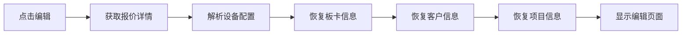
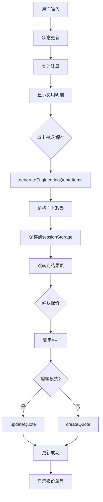

# 工程机时报价功能总结报告

> **文档版本**: v2.0
> **最后更新**: 2025-10-01
> **报告类型**: 功能总结与技术架构

---

## 📋 目录

- [1. 功能概述](#1-功能概述)
- [2. 核心功能特性](#2-核心功能特性)
- [3. 技术架构](#3-技术架构)
- [4. 数据流程](#4-数据流程)
- [5. 关键技术实现](#5-关键技术实现)
- [6. 最佳实践](#6-最佳实践)
- [7. 后续优化方向](#7-后续优化方向)

---

## 1. 功能概述

### 1.1 业务定位

工程机时报价是芯片测试报价系统的核心功能之一，用于为**工程阶段的芯片测试**提供自动化、标准化的报价服务。

**适用场景**：
- 工程验证阶段的芯片测试
- 需要灵活配置设备和人员的测试项目
- 机时费为主要计费单位的报价

**业务价值**：
- ✅ 自动计算机时费用，减少人工计算错误
- ✅ 统一定价规则，提升报价一致性
- ✅ 实时生成报价，加快客户响应速度
- ✅ 支持报价编辑，灵活应对需求变化

---

## 2. 核心功能特性

### 2.1 统一的新建/编辑体验 ⭐

**设计理念**：新建报价单和编辑报价单使用完全相同的逻辑和页面，只是初始数据来源不同。

#### 关键实现：

1. **统一数据源**
   ```javascript
   // 新建模式：数据源为空
   const initialData = {};

   // 编辑模式：数据源来自数据库
   const initialData = await fetchQuoteFromDB(quoteId);

   // 两种模式使用同一个页面组件
   <EngineeringQuote initialData={initialData} isEditMode={!!quoteId} />
   ```

2. **统一状态管理**
   - 使用 `useQuoteEditMode` Hook 统一管理编辑状态
   - sessionStorage 保存中间状态，支持页面跳转
   - 编辑模式标识贯穿整个流程

3. **统一保存逻辑**
   ```javascript
   // 根据编辑模式调用不同API，但数据结构完全一致
   if (isEditMode) {
     await updateQuote(quoteId, quoteData);
   } else {
     await createQuote(quoteData);
   }
   ```

**优势**：
- ✅ 代码复用率高，减少维护成本
- ✅ 用户体验一致，降低学习成本
- ✅ 易于扩展，新功能自动适用于两种模式

---

### 2.2 智能设备配置系统

#### 2.2.1 三类核心设备支持

| 设备类型 | 说明 | 配置特点 |
|---------|------|---------|
| **测试机** | 主要测试设备 | 支持多板卡配置，板卡数量可调 |
| **分选机** | 芯片分选设备 | 支持多板卡配置，板卡数量可调 |
| **探针台** | 探针测试平台 | 支持多板卡配置，板卡数量可调 |

#### 2.2.2 板卡配置管理 ⭐

**创新点：JSON序列化存储**

```javascript
// 板卡信息序列化存储在configuration字段
const configuration = JSON.stringify({
  device_type: '测试机',
  device_model: testMachine.name,
  cards: [
    {
      id: 21,
      board_name: 'APU-12',
      part_number: 'ASM2160',
      quantity: 4
    },
    // ... 更多板卡
  ]
});
```

**解决的问题**：
- ❌ 旧方案：每个板卡作为独立报价条目，导致明细冗余
- ✅ 新方案：板卡信息作为设备配置的一部分，仅保存设备汇总条目

**编辑时恢复**：
```javascript
// 从JSON配置中解析板卡信息
const jsonFormatCards = deviceGroups.testMachine
  .filter(item => {
    const config = JSON.parse(item.configuration || '{}');
    return config.cards && Array.isArray(config.cards);
  })
  .flatMap(item => {
    const config = JSON.parse(item.configuration);
    return config.cards.map(cardInfo => ({
      id: cardInfo.id,
      board_name: cardInfo.board_name,
      part_number: cardInfo.part_number,
      quantity: cardInfo.quantity
    }));
  });
```

#### 2.2.3 板卡数量管理

**持久化机制**：
```javascript
// 板卡数量独立存储，防止取消选中后丢失
const [persistedCardQuantities, setPersistedCardQuantities] = useState({
  'testMachine-21': 4,
  'testMachine-22': 2,
  // ...
});

// 在表格中正确显示数量
<InputNumber
  value={selectedCard?.quantity || persistedCardQuantities[cardKey] || 1}
  onChange={(value) => handleCardQuantityChange(machineType, cardId, value)}
/>
```

**优势**：
- ✅ 用户修改数量后，即使取消选中再重新选中，数量仍然保留
- ✅ 编辑报价单时，正确恢复所有板卡的数量
- ✅ 数量状态统一管理，避免数据不一致

---

### 2.3 多币种报价支持

#### 2.3.1 支持币种

- **CNY (人民币)** - 主要币种
- **USD (美元)** - 国际业务

#### 2.3.2 汇率管理

```javascript
// 报价级别的汇率设置
const [quoteCurrency, setQuoteCurrency] = useState('CNY');
const [quoteExchangeRate, setQuoteExchangeRate] = useState(7.2);

// 设备级别的汇率（来自设备主数据）
device.exchange_rate  // 如：7.0
device.currency       // 如：'USD'
```

#### 2.3.3 价格转换逻辑

```javascript
// 设备价格转换规则
if (quoteCurrency === 'USD') {
  if (device.currency === 'CNY') {
    // CNY设备 -> USD报价：除以报价汇率
    adjustedPrice = adjustedPrice / quoteExchangeRate;
  }
  // USD设备：直接使用
} else {
  // CNY报价：使用设备汇率
  adjustedPrice = adjustedPrice * device.exchange_rate;
}
```

---

### 2.4 精确的价格取整逻辑 ⭐

#### 2.4.1 分级取整策略

**报价明细（unit_price / total_price）**：
```javascript
// CNY: 向上取整到元（个位）
ceilByCurrency(268.75, 'CNY')  // => 269

// USD: 向上取整到百分位
ceilByCurrency(268.754, 'USD')  // => 268.76
```

**中间计算（仅显示）**：
```javascript
// CNY: 四舍五入到百分位
formatIntermediatePrice(268.754, 'CNY')  // => "268.75"

// USD: 向上取整到百分位
formatIntermediatePrice(268.754, 'USD')  // => "268.76"
```

#### 2.4.2 格式化显示

```javascript
// CNY: 整数显示，无小数
formatQuotePrice(269, 'CNY')  // => "269"

// USD: 两位小数显示
formatQuotePrice(268.76, 'USD')  // => "268.76"
```

**应用场景**：
- ✅ 报价单明细：所有item价格按币种向上取整后存储
- ✅ 总价计算：汇总后再次向上取整
- ✅ 页面显示：使用格式化函数统一展示

---

### 2.5 工程系数管理

```javascript
// 工程系数应用于所有机器设备
const [engineeringRate, setEngineeringRate] = useState(1.2);

// 计算含工程系数的费率
const testMachineRate = calculateTestMachineFee() * engineeringRate;
const handlerRate = calculateHandlerFee() * engineeringRate;
const proberRate = calculateProberFee() * engineeringRate;

// 辅助设备不应用工程系数
const auxDeviceRate = calculateAuxDeviceHourlyRate(device);
```

**规则**：
- ✅ 测试机、分选机、探针台：应用工程系数
- ✅ 辅助设备：不应用工程系数
- ✅ 人员费用：不应用工程系数

---

### 2.6 完善的编辑流程 ⭐

#### 2.6.1 编辑入口

```javascript
// 从报价管理页面点击"编辑"
navigate('/engineering-quote', {
  state: {
    isEditing: true,
    editingQuote: quoteData,
    quoteId: quoteData.id
  }
});
```

#### 2.6.2 数据恢复流程



**关键步骤**：

1. **设备恢复**
   ```javascript
   // 优先使用数据库中的machine_id
   const machineId = firstItem.machine_id || findMachineIdByName(machineName);
   const fullMachine = availableMachines.find(m => m.id === machineId);
   ```

2. **板卡恢复**
   ```javascript
   // 支持多种格式兼容
   if (jsonFormatCards.length > 0) {
     config.testMachineCards = jsonFormatCards;  // 新格式
   } else if (detailedFormatCards.length > 0) {
     config.testMachineCards = detailedFormatCards;  // 详细格式
   } else {
     config.testMachineCards = oldFormatCards;  // 旧格式
   }
   ```

3. **数量恢复**
   ```javascript
   // 为板卡数量创建持久化数据
   deviceConfig.testMachineCards?.forEach(card => {
     cardQuantities[`testMachine-${card.id}`] = card.quantity || 1;
   });
   setPersistedCardQuantities(cardQuantities);
   ```

#### 2.6.3 编辑保存

```javascript
// 编辑模式：更新现有报价单
if (isEditMode) {
  resultQuote = await QuoteApiService.updateQuote(editingQuoteId, quoteData);
  message.success(`报价单更新成功！报价单号：${resultQuote.quote_number}`);
}
```

#### 2.6.4 "上一步"功能 ⭐

**问题**：从结果页返回编辑页时，数据和状态丢失

**解决方案**：
```javascript
// 1. 保存完整状态到sessionStorage
const previousStepData = {
  // 设备配置
  testMachine, handler, prober,
  testMachineCards, handlerCards, proberCards,
  selectedPersonnel, selectedAuxDevices,
  // 报价参数
  engineeringRate, quoteCurrency, quoteExchangeRate,
  persistedCardQuantities,
  // 编辑模式信息 ⭐
  isEditMode: true,
  editingQuoteId: quoteData.editingQuoteId,
  editingQuoteNumber: quoteData.quoteNumber,  // 保存报价单号
  // 客户和项目信息 ⭐
  customerInfo, projectInfo,
  fromResultPage: true
};

// 2. 传递到location.state
navigate('/engineering-quote', {
  state: {
    fromResultPage: true,
    isEditing: true,
    quoteId: quoteData.editingQuoteId,
    quoteNumber: quoteData.quoteNumber
  }
});

// 3. 在编辑页面恢复
if (location.state?.fromResultPage) {
  const storedData = sessionStorage.getItem('quoteData');
  // 恢复所有状态...
  setCustomerInfo(parsedData.customerInfo);
  setProjectInfo(parsedData.projectInfo);
  // ...
}
```

**结果**：
- ✅ 页面标题正确显示："编辑工程机时报价 - CIS-SZ20251001001"
- ✅ 客户信息、项目信息完整保留
- ✅ 设备配置、板卡选择、数量全部保留
- ✅ 编辑模式标识正确传递

---

## 3. 技术架构

### 3.1 前端架构

```
EngineeringQuote.js (主组件)
├── useQuoteEditMode (编辑模式Hook)
├── useState (状态管理)
│   ├── customerInfo (客户信息)
│   ├── projectInfo (项目信息)
│   ├── testMachine/handler/prober (设备)
│   ├── testMachineCards/handlerCards/proberCards (板卡)
│   ├── persistedCardQuantities (板卡数量持久化)
│   ├── selectedPersonnel (人员)
│   ├── selectedAuxDevices (辅助设备)
│   └── engineeringRate/quoteCurrency (报价参数)
├── 计算函数
│   ├── calculateTestMachineFee()
│   ├── calculateHandlerFee()
│   ├── calculateProberFee()
│   ├── calculatePersonnelFeeForQuote()
│   └── calculateAuxDeviceHourlyRate()
└── generateEngineeringQuoteItems() (生成报价明细)
```

### 3.2 数据流程图



### 3.3 关键Hook: useQuoteEditMode

**职责**：
1. 检测编辑模式（location.state 或 URL参数）
2. 加载报价数据（从API或sessionStorage）
3. 转换数据格式（数据库格式 -> 表单格式）

**核心逻辑**：
```javascript
const useQuoteEditMode = () => {
  const [isEditMode, setIsEditMode] = useState(false);
  const [editingQuote, setEditingQuote] = useState(null);

  useEffect(() => {
    // 方式1: 从location.state检测
    if (location.state?.isEditing) {
      setIsEditMode(true);

      // 从结果页返回：使用sessionStorage数据
      if (location.state?.fromResultPage) {
        setEditingQuote({
          id: location.state.quoteId,
          quote_number: location.state.quoteNumber
        });
      }
      // 正常编辑：获取完整数据
      else if (location.state?.quoteId) {
        const quoteData = await fetchQuoteById(location.state.quoteId);
        setEditingQuote(quoteData);
      }
    }

    // 方式2: 从URL参数检测
    const editQuoteId = urlParams.get('edit');
    if (editQuoteId) {
      const quoteData = await fetchQuoteById(editQuoteId);
      setEditingQuote(quoteData);
      setIsEditMode(true);
    }
  }, [location]);

  return { isEditMode, editingQuote, loading, convertQuoteToFormData };
};
```

---

## 4. 数据流程

### 4.1 新建报价单流程

```
1. 用户进入工程报价页面
   ↓
2. 选择设备和板卡
   ↓
3. 设置板卡数量（持久化存储）
   ↓
4. 选择人员和辅助设备
   ↓
5. 填写客户信息和项目信息
   ↓
6. 点击"完成报价"
   ↓
7. generateEngineeringQuoteItems() 生成明细
   ↓
8. 对每个item的价格进行向上取整
   ↓
9. 保存到sessionStorage
   ↓
10. 跳转到结果页显示
   ↓
11. 点击"确认报价"
   ↓
12. 调用createQuote API保存到数据库
```

### 4.2 编辑报价单流程

```
1. 从报价管理页点击"编辑"
   ↓
2. navigate('/engineering-quote', { state: { isEditing: true, quoteId } })
   ↓
3. useQuoteEditMode检测编辑模式
   ↓
4. 从API获取报价详情
   ↓
5. convertQuoteToFormData转换数据格式
   ↓
6. 恢复所有状态（设备、板卡、客户信息等）
   ↓
7. 显示编辑页面（与新建页面相同）
   ↓
8. 用户修改数据
   ↓
9. 点击"保存编辑"
   ↓
10. generateEngineeringQuoteItems() 生成明细
   ↓
11. 价格向上取整
   ↓
12. 保存到sessionStorage（包含编辑模式标识）
   ↓
13. 跳转到结果页
   ↓
14. 点击"确认报价"
   ↓
15. 调用updateQuote API更新数据库
```

### 4.3 "上一步"返回流程 ⭐

```
1. 结果页点击"上一步"
   ↓
2. 构建previousStepData（包含所有状态）
   ↓
3. 保存到sessionStorage
   ↓
4. navigate('/engineering-quote', {
     state: {
       fromResultPage: true,
       isEditing: true,
       quoteId,
       quoteNumber
     }
   })
   ↓
5. useQuoteEditMode检测fromResultPage
   ↓
6. 不从API获取数据，使用sessionStorage
   ↓
7. 编辑页面从sessionStorage恢复所有状态
   ↓
8. 显示完整的编辑页面（标题、数据全部正确）
```

---

## 5. 关键技术实现

### 5.1 板卡信息的序列化与反序列化

#### 序列化（保存时）
```javascript
// EngineeringQuote.js - generateEngineeringQuoteItems()
const cardsInfo = testMachineCards.map(card => ({
  id: card.id,
  board_name: card.board_name,
  part_number: card.part_number,
  quantity: card.quantity || 1
}));

const configuration = JSON.stringify({
  device_type: '测试机',
  device_model: testMachine.name,
  cards: cardsInfo
});
```

#### 反序列化（编辑时）
```javascript
// useQuoteEditMode.js - convertQuoteToFormData()
const jsonFormatCards = deviceGroups.testMachine
  .filter(item => {
    try {
      const config = JSON.parse(item.configuration || '{}');
      return config.cards && Array.isArray(config.cards);
    } catch (e) {
      return false;
    }
  })
  .flatMap(item => {
    const config = JSON.parse(item.configuration);
    return config.cards.map(cardInfo => {
      const realCard = availableCardTypes.find(card => card.id === cardInfo.id);
      return {
        id: cardInfo.id,
        part_number: cardInfo.part_number,
        board_name: cardInfo.board_name,
        unit_price: realCard ? realCard.unit_price : 0,
        quantity: cardInfo.quantity || 1,
        machine_id: machineId
      };
    });
  });
```

**兼容性处理**：
```javascript
// 支持多种历史格式
if (jsonFormatCards.length > 0) {
  config.testMachineCards = jsonFormatCards;  // JSON格式（新）
} else if (detailedFormatCards.length > 0) {
  config.testMachineCards = detailedFormatCards;  // 详细格式
} else if (newFormatCards.length > 0) {
  config.testMachineCards = newFormatCards;  // card_info格式
} else {
  config.testMachineCards = oldFormatCards;  // 旧格式
}
```

---

### 5.2 价格计算与取整

#### 计算流程
```javascript
// 1. 计算原始费率
const testMachineRate = calculateTestMachineFee() * engineeringRate;

// 2. 向上取整
const ceiledRate = ceilByCurrency(testMachineRate, quoteCurrency);

// 3. 保存到item
items.push({
  item_name: testMachine.name,
  unit_price: ceiledRate,
  total_price: ceiledRate,
  // ...
});
```

#### 取整函数
```javascript
// utils.js
export const ceilByCurrency = (num, currency) => {
  if (currency === 'USD') {
    // USD: 检查是否有千分位及以下的数值
    const rounded = Math.round(num * 100) / 100;
    const hasDecimalsBelow = Math.abs(num - rounded) > 0.000001;

    if (hasDecimalsBelow) {
      return Math.ceil(num * 100) / 100;  // 向上取整到百分位
    } else {
      return rounded;  // 保持原值
    }
  } else {
    // CNY: 向上取整到个位
    return Math.ceil(num);
  }
};
```

---

### 5.3 状态持久化策略

#### sessionStorage使用
```javascript
// 1. 保存完整状态
const quoteData = {
  type: '工程报价',
  customerInfo,
  projectInfo,
  testMachine,
  // ... 所有状态
  isEditMode,
  editingQuoteId,
  quoteNumber,  // ⭐ 报价单号
};
sessionStorage.setItem('quoteData', JSON.stringify(quoteData));

// 2. 恢复状态
const storedData = sessionStorage.getItem('quoteData');
if (storedData) {
  const parsedData = JSON.parse(storedData);
  setCustomerInfo(parsedData.customerInfo);
  setProjectInfo(parsedData.projectInfo);
  // ...
}

// 3. 清理策略
if (!isFromResultPage) {
  sessionStorage.removeItem('quoteData');  // 正常进入时清空
}
```

#### 板卡数量持久化
```javascript
// 独立的数量状态，不依赖于选中状态
const [persistedCardQuantities, setPersistedCardQuantities] = useState({});

// 修改数量时更新
const handleCardQuantityChange = (machineType, cardId, quantity) => {
  setPersistedCardQuantities(prev => ({
    ...prev,
    [`${machineType}-${cardId}`]: quantity
  }));

  // 同时更新选中的卡片
  if (machineType === 'testMachine') {
    setTestMachineCards(prevCards =>
      prevCards.map(card =>
        card.id === cardId ? { ...card, quantity } : card
      )
    );
  }
};

// 选中卡片时读取持久化的数量
const rowsWithQuantity = selectedRows.map(row => {
  const cardKey = `${machineType}-${row.id}`;
  return {
    ...row,
    quantity: persistedCardQuantities[cardKey] || 1
  };
});
```

---

### 5.4 编辑模式的数据流控制

#### 避免重复加载
```javascript
// useQuoteEditMode.js
if (location.state?.fromResultPage && location.state?.quoteId) {
  // 从结果页返回：不重新获取数据
  setEditingQuote({
    id: location.state.quoteId,
    quote_number: location.state.quoteNumber
  });
  setLoading(false);
} else if (location.state?.quoteId) {
  // 正常编辑：从API获取完整数据
  const quoteData = await QuoteApiService.getQuoteDetailById(quoteId);
  setEditingQuote(quoteData);
}
```

#### 跳过数据转换
```javascript
// EngineeringQuote.js
useEffect(() => {
  // 从结果页返回时，跳过数据转换
  if (location.state?.fromResultPage) {
    return;
  }

  // 正常编辑模式：执行数据转换
  if (isEditMode && editingQuote && !editDataLoaded) {
    const formData = convertQuoteToFormData(editingQuote);
    // 填充表单...
    setEditDataLoaded(true);
  }
}, [isEditMode, editingQuote, location.state?.fromResultPage]);
```

---

## 6. 最佳实践

### 6.1 代码组织

✅ **统一的数据源**
- 新建和编辑使用同一个页面组件
- 通过props或state区分模式
- 避免代码重复

✅ **清晰的状态管理**
- 每个功能模块独立的state
- 使用自定义Hook封装复杂逻辑
- sessionStorage作为页面间的数据桥梁

✅ **可扩展的数据格式**
- JSON配置支持灵活扩展
- 兼容多种历史格式
- 版本化的数据结构

### 6.2 用户体验

✅ **流畅的编辑体验**
- 编辑和新建界面完全一致
- 状态完整保留，避免数据丢失
- 响应式的价格计算和显示

✅ **明确的操作反馈**
- 清晰的页面标题（显示报价单号）
- 实时的费用明细显示
- 保存成功的明确提示

✅ **灵活的数据修改**
- 支持任意修改设备和板卡
- 板卡数量独立管理
- "上一步"功能完整保留状态

### 6.3 数据一致性

✅ **价格计算一致性**
- 统一的计算函数
- 统一的取整规则
- 数据库存储和显示完全一致

✅ **编辑数据一致性**
- 优先使用数据库中的machine_id
- 板卡信息完整恢复（包括数量）
- 客户和项目信息完整保留

✅ **多格式兼容性**
- 支持多种历史数据格式
- 向前兼容，不破坏旧数据
- 新格式优先，自动升级

---

## 7. 后续优化方向

### 7.1 可借鉴到量产报价的特性

以下特性应该应用到量产机时报价：

#### ⭐ 高优先级
1. **统一新建/编辑逻辑**
   - 同一个页面组件处理两种模式
   - 统一的状态管理和数据流
   - 编辑时完整恢复所有状态

2. **板卡JSON序列化存储**
   - 避免板卡作为独立条目
   - 配置信息集中管理
   - 编辑时准确恢复

3. **价格向上取整**
   - 所有明细item价格取整
   - 按币种应用不同规则
   - 数据库和显示一致

4. **"上一步"功能完善**
   - 保留编辑模式标识
   - 保留报价单号
   - 保留所有用户输入

5. **板卡数量持久化**
   - 独立的数量状态管理
   - 取消选中不丢失数量
   - 编辑时正确恢复

#### 🔧 中优先级
6. **多币种支持优化**
   - 统一的汇率转换逻辑
   - 清晰的价格显示格式

7. **数据格式兼容性**
   - 支持多种历史格式
   - 平滑的数据迁移

8. **错误处理增强**
   - Null检查和保护
   - 清晰的错误提示

### 7.2 量产报价特有需求

考虑量产报价的特殊性，需要额外实现：

1. **FT和CP分离配置**
   - 两种测试类型独立的设备选择
   - 分别的板卡配置

2. **UPH计算**
   - 基于UPH的价格计算
   - 多种UPH模式支持

3. **批量计算**
   - 测试数量的影响
   - 批量折扣

### 7.3 系统级优化

1. **性能优化**
   - 大量数据时的渲染优化
   - 计算函数的缓存

2. **测试覆盖**
   - 编辑流程的E2E测试
   - 价格计算的单元测试

3. **文档完善**
   - API文档更新
   - 用户操作手册

---

## 📊 功能对比表

| 功能特性 | 工程机时报价 | 量产机时报价（待优化） |
|---------|------------|---------------------|
| 统一新建/编辑 | ✅ 已实现 | ❌ 待实现 |
| 板卡JSON存储 | ✅ 已实现 | ❌ 待实现 |
| 价格向上取整 | ✅ 已实现 | ❌ 待实现 |
| "上一步"功能 | ✅ 已实现 | ❌ 待实现 |
| 板卡数量持久化 | ✅ 已实现 | ❌ 待实现 |
| 编辑模式标识 | ✅ 已实现 | ❌ 待实现 |
| 报价单号显示 | ✅ 已实现 | ❌ 待实现 |
| 客户信息保留 | ✅ 已实现 | ❌ 待实现 |
| 多格式兼容 | ✅ 已实现 | ❌ 待实现 |

---

## 🎯 下一步行动计划

### 阶段1: 量产报价核心功能移植（优先级：高）

**目标**：将工程报价的核心改进应用到量产报价

**任务清单**：
1. ✅ 分析量产报价现有代码结构
2. ✅ 统一新建/编辑逻辑
3. ✅ 实现板卡JSON序列化
4. ✅ 应用价格向上取整
5. ✅ 完善"上一步"功能
6. ✅ 实现板卡数量持久化

**预计工作量**: 2-3天

### 阶段2: 量产报价特有功能优化（优先级：中）

**目标**：针对量产报价的业务特点进行优化

**任务清单**：
1. FT/CP独立配置优化
2. UPH计算逻辑完善
3. 批量折扣功能

**预计工作量**: 1-2天

### 阶段3: 系统整体优化（优先级：低）

**目标**：提升系统整体质量

**任务清单**：
1. 性能优化
2. 测试覆盖
3. 文档更新

**预计工作量**: 1-2天

---

## 📝 总结

工程机时报价功能经过本次优化，已经建立了一套**成熟、稳定、易维护**的技术方案：

### 核心优势
1. ⭐ **统一的新建/编辑体验** - 降低开发和维护成本
2. ⭐ **智能的板卡管理** - JSON序列化存储，避免冗余
3. ⭐ **精确的价格计算** - 分币种向上取整，财务准确
4. ⭐ **完善的状态管理** - 数据持久化，用户体验流畅
5. ⭐ **强大的编辑功能** - 完整恢复数据，支持灵活修改

### 可移植性
- ✅ 所有核心特性都可以应用到量产报价
- ✅ 提供了清晰的实现参考
- ✅ 建立了最佳实践标准

### 下一步
参照本报告，对**量产机时报价**进行系统性优化，实现两种报价类型的功能对齐和体验统一。

---

**报告完成日期**: 2025-10-01
**文档维护**: 请在每次重大功能更新后同步更新本文档
